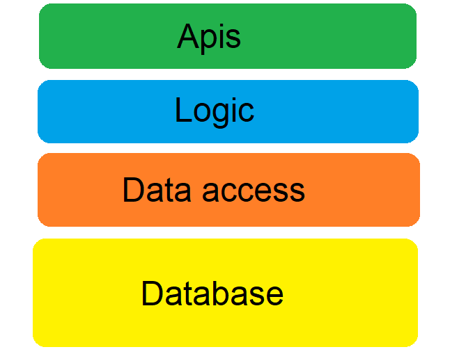
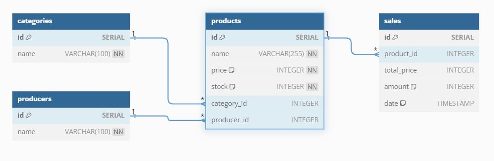
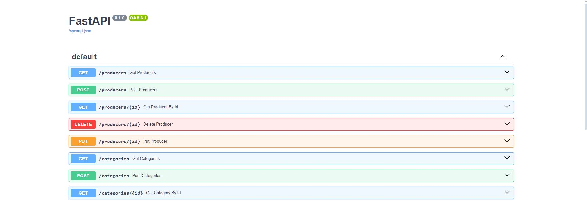

# 📦 Product Inventory Management System 🌟
This project showcases the backend of a product inventory management system built using FastAPI as the Framework, PosgreSQL as the Database and following a Layered Architechture.

## 📋 Table of content
- [📌 Project Scope](#-project-scope)
- [🔧 Technologies](#-technologies-used)
- [📐 Architecture](#-architecture)
- [💾 Database](#-database)
- [🧪 Testing](#-testing)
- [🌐 API Endpoints](#-api-endpoints)
- [📂 Directory Structure](#-directory-structure)
- [📥 Installation](#-installation)
- [🚀 Usage](#-usage)

## 📌 Project Scope
This project simulates the backend of an inventory management system with a focus on creating a robust and scalable code. The project scope includes functionalities such as all CRUD interactions with the products along with the posibility to group them by category or producer. Also the ability to track sales, automatically updating the stock count. 

## 🔧 Technologies Used
- Python 🐍
- FastAPI ⚡
- PosgreSQL 🐘
- Docker 🐋
- Pytest 🧪

## 📐 Architecture
The project's code organization follows a layered architecture, where each layer communicates with the one above or below it. This allows some processes such as data validation and database queries to be separated, making it easier to track the process and prevent security bugs.

### APIs Layer 📡
This layer handles the http requests. After receiving the request it calls the logic layer and after receiving the response it returns a json with the information.
### Logic Layer 🧠
After the http request, this layer validates the data received from the APIs layer and calls the Data Access layer if the data is valid, otherwise it returns an error message.
### Data Access Layer 🗃️
This layer makes the Database queries with the validated data from the Logic layer and returns the information.
### Database Layer 🗂️
The last layer is the Database itself, where the app data is stored.

## 💾 Database

The database is a PosgreSQL one and is hosted in a Docker container. It contains 4 different tables:
- **Categories**: Contains the categories of the products.
- **Producers**: Contains the different producers.
- **Products**: Contains all the products of the bussiness and their information.
- **Sales**: Contains the transaction history.

### Categories 🏷️ & Producers 🏭
Stores the name of the category/producer to be referenced in the products table. This makes it easier to divide the products into different groups and manipulate them more efficiently.
### Products 🛍️
Stores a product's name, price, stock, category, and producer. 
### Sales 🛒
Keeps track of the sales made, tracks the stock movement and automatically updates the stock of products after each sale.

## 🧪 Testing
This project contains 50 tests that checks APIs functionalities along with the data validation process, making requests with invalid data and checking if the error message pops up correctly. All these tests are automatically executed by github after every push/pull request. You can check the green checkmark "✅" at the top of the repository. This ensures that everything is working correctly.
#### Important note before testing execution ⚠️
To properly test the CRUD endpoint, the database must be recreated before running the tests. Otherwise, the tests will fail.

## 🌐 API endpoints
The endpoints include CRUD capabilities over the 4 tables, a filter query for products, stock update options and an easy way to update many prices at once. This last feature is especially useful in countries with high inflation, something that is not normally present in inventory management systems.  
For specific information about all the endpoints and methods allowed [click here!](endpoints_documentation.md)

## 📂 Directory Structure

- **.github/workflows/**: Tells githb to run the tests.
- **backend/**: Backend layers.
    - **apis/**: App endpoints.
        - **utils/**: Response functions used in the apis.
    - **logic/**: Data validation process.
        - **validations/**: Validation functions used in multiple instances.
    - **data_access/**: Database comunication.
        - **utils/**: Success check function.
    - **models/**: Models used to encapsulate data.
- **database/**: Database scripts.
- **tests/**: Project tests.
- **readme_images/**: Images for the README you are reading

## 📥 Installation

### Prerequisites

- Python 🐍
- Docker 🐋
- Git 🛠️

### Steps

1. **Clone the repository**:
    ```bash
    git clone https://github.com/JuanNovas/Product-Inventory-Management-System.git
    cd Product-Inventory-Management-System
    ```
2. **Create and activate a virtual environment**:
    ```bash
    python -m venv venv
    source venv/bin/activate  # On Windows use `venv\Scripts\activate`
    ```
3. **Install dependencies**:
    ```bash
    pip install -r requirements.txt
    ```
4. **Set up the database container**:
    ```bash
    docker-compose up -d
    ```
5. **Execute the main script**:
    ```bash
    python main.py
    ```

## 🚀 Usage
To try this application yourself, you can use tools like Postman or Insomnia. There is also a built-in option from FastAPI that will display a Swagger web page at http://127.0.0.1:8000/docs when you run the program.


## Thank You ❤️

Thanks for checking out my project, give me a star 🌟 if you like it. 
For any questions or feedback, please contact me at [juanignacionovas@gmail.com](mailto:juanignacionovas@gmail.com).